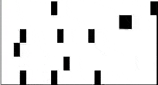

# Advent of Code 2019
Solving puzzles of AoC19, probably all with Python. 

Third year I'm joining this cool challenge. Goal is just to solve 
every puzzle within the day. Besides that I'm going to focus on
the use of Python and writing Pythonic code (or finding out what
it's about..).

In this readme, just some notes about the puzzles, my code and other 
solutions I have seen. All solution can be found in this repository.

## [--- Day 1: The Tyranny of the Rocket Equation ---](https://adventofcode.com/2019/day/1)

Easy puzzle today, took a couple of minutes to make it work
with a generator in a list comprehension. More straight-forward
solution would be a while loop and extra checks. Tried to make
it "pythonic" and short.

Notable part for this puzzle (is all the code for solving):
``` python
total = 0
while len(data) > 0:
   data = [i for i in (x // 3 - 2 for x in data) if i > 0]
   total += sum(data)
```

## [--- Day 2: 1202 Program Alarm ---](https://adventofcode.com/2019/day/2)

Started with using a module to get my puzzle input automatically
without copy and pasting (just for fun, because I'm not waking 
up early enough for a leaderboard *attempt*). The module is 
called [advent-of-code-data (aocd)](https://github.com/wimglenn/advent-of-code-data). 
You can even make automatic submissions, but I'm not touching that yet.

This puzzle was insipred by the Apollo Guidance Computer, which
used two parameters to activate a command, consisting of a mapping
between a number and a verb and a number and a noun.

Today's puzzle was a bit harder to read, but the solution was
straight forward. Bruteforce worked in Python to find the two
paramters. It would be fun to fit the parameters smarter with
some kind of binary search algorithm, but I didn't wrap my head
around that and probably it wouldn't even work.

Got some errors to start with, because I was manipulating the
list and in the next iteration, starting with the manipulated array.
To fix that, I had to initialize the list every iteration of course.
Did that with a deepcopy of the initial list.

## [--- Day 3: Crossed Wires ---](https://adventofcode.com/2019/day/3)

This puzzle reminded me of the "[Mine cart madness](https://adventofcode.com/2018/day/13)" puzzle of last year,
running a cart through a grid and calculating where carts would crash
with each other.

This time it are no carts, but wires that could be intersected. Part 1
was searching for the closest intersection with the manhattan distance.
Second part you should account for the total number of steps covered by
the wires. From part 1 to part 2, it was a change from a list to a dict.

Still no fancy solutions, straight forward did the job just fine. Some
smart trick that I saw from a fellow-AOCer was using a dictionary to
change directions instead of a ugly `if/elif` construction.

``` python
if heading == "R":
    dxy = (1,0)
elif heading == "L":
    dxy = (-1,0)
=elif heading == "U":
    dxy = (0,-1)
elif heading == "D":
    dxy = (0,1)
```

Could be:

``` python
deltas = {'R': (1, 0), 'L': (-1, 0), 'U': (0, 1), 'D': (0, -1)}
# ...
dxy = deltas[heading]
```

Which is a lot nicer and easier to expand.

## [--- Day 4: Secure Container ---](https://adventofcode.com/2019/day/4)

So today the puzzle was to generate 6-digit-numbers between two
given input numbers and decide if this number was a valid password.
Valid means:

- All digits must be ascending or equal to the previous digit
- There must be a group of two of the same digits in the number
- For part 2: a group of three or more of the same digits does not count, so it needs to be a group of exactly two of the same digits

Not too hard day either, but needed some juggling with booleans and
if/elis constructions after it worked. After my train ride to work
I figured out the problem was more restricted than I tought and I
came up with a easier solution:

``` python
# After understanding the requirements better, this does a nicer job solving it.
# Sorting the array and checking if is equal, means it is increasing in number
# After that it is possible to do counts for the number, because it is sorted it
# is not possible to get something like 223324 in the input (which would work with
# my original solution, but was not the question). That's why a simple count works.
def solve(data):
    candidates = []
    for x in range(data[0], data[1]):
        rep = str(x)
        if "".join(sorted(rep)) == rep:
            for i in set(rep):
                if rep.count(i) == 2:
                    candidates.append(x)
                    break
    print ("Part 2: {}".format(len(candidates)))
```

Even a more pythonic solution from a fellow AoCer to check if a password is a candidate for part 1:

``` python
def is_password(num):
    s = str(num)
    adjacent = any(a == b for a, b in zip(s, s[1:]))
    monotonic = all(a <= b for a, b in zip(s, s[1:]))
    return adjacent and monotonic
```

I wouldn't come up with that solution, very nice and short.


But the most funny thing today was Roland's bad ass solution:

``` python
passwords = list()
for i in range(1, 7):
    for j in range(i, 10):
        for k in range(j, 10):
            for l in range(k, 10):
                for m in range(l, 10):
                    for n in range(m, 10):
                        number = int(''.join([str(i),str(j),str(k),str(l),str(m),str(n)]))
                        if number >= 138241 and number <= 674034 and (i==j or j==k or k==l or l==m or m==n):
                            passwords.append(number)
print(len(passwords))
```

Pythonic, eh? :')

## [--- Day 5: Sunny with a Chance of Asteroids ---](https://adventofcode.com/2019/day/5)

Today we continued where we left of in day 2. The task was to expand the 
Intcode computer with a diagnostics program. This involved some thorough
reading, adding some functions corresponding to *opcodes* and figuring 
out which number needs to be submitted after the program terminates.

This kind of assembly-like puzzles were also present last year, and 
these aren't my favorites, because if you have read and undestood the 
assignment, the implementation is quite straight-forward. There are no
algorithmic challenges involved, just "more of the same".

One thing I learned today from was formatting a integer, so it got 
leading zero's. This is easily done with f-strings:

``` python
>>> f"{1:04}
'0001'
>>> f"{103:04}
'0103'
>>> f"{1101:04}
'1101'
```

This way you convert it to a string with the "width" you need.

Next!

## [--- Day 6: Universal Orbit Map ---](https://adventofcode.com/2019/day/6)

Some graph theory comes in handy today. There are objects orbitting around each
other and in part 1 you need to figure out how many objects are orbiting directly
and idirectly around all objects. Sounds like a recursive problem.

I calculate the total objects orbiting recursively, but the objects are iterated
over multiple times, so I store the solution in the object member variable: 
`self.total`. 

``` python    
def get_orbits(self):
    if self.total < 0:
        total = len(self.orbits_around)
        for n in self.orbits_around:
            total += n.get_orbits()
        self.total = total
    return self.total
```

The second part was to find the shortest path from a startnode to an endnode. 
In part one it was a directed graph (a simple tree), but in this case you could
also travel in opposite direction, so I needed to make it bidirectional (simply
added the parents to the neighbours) and used breadth first search to find the
shortest path. Not very exciting, but I like these puzzles more that the Intcode
computer.

## [--- Day 7: Amplification Circuit ---](https://adventofcode.com/2019/day/7)

Oh no, the Intcode computer again! This time there needed to be five instances of
the Intcomputer running with their own data. With initial input values
and tying the instances together with an input/output relation, you need to calculate 
the output of the fifth instance. The initial input values are permutations of five
different numbers and in part 1 the task is to calculate the maximum output with these
input values. 

Of course you can/have to reuse your Intcomputer from day 5 to do the calculations.

The second part was hard to understand, but the fifth instance is tied back to the
first instance. So the last output is feeded back. Eventually the program halts 
somwhere and you need to keep track of the maximum output that you have seen.
Another caveat is that every instance got it's own data and this stays in memory
for the whole run.

I keep track of the instructionpointer where the instance halted and when it needs
to be ran again, I pass that instructionpointer so it can continue where it left of.
But what really happens is just a new function call, with the mutated data and the
new pointer.

This was the first thing I thought of and worked out fine, but looking at other
solutions, the nicest way of solving this in Python is using generators. This way the 
instance can really "halt" at a point when it yields output, which the next instance 
takes as input. When a halted instance receives input again, it can continue where 
it left of. Very nice way of using generators.

Solution by [andreyrmg](https://www.reddit.com/user/andreyrmg/) with some comments
from me:

``` python
m = 0
for x in permutations(range(5, 10)):
    gs = []
    for phase in x:
        # first sweep for all instances, using the phase variables 
        g = run(phase)  # initializes generator
        next(g)         # runs to first yield and halts (waits for input to be send)
        g.send(phase)   # sends phase variable to where the generator halted, runs until yield is called again and something is returned
        gs.append(g)
    signal = 0
    while True:
        for g in gs:
            signal = g.send(signal)     # runs generator where it left of with signal variable as input
        try:
            for g in gs:
                next(g)                 # runs to next yield which should wait for input. If it's not reaching this yield, generator throws StopIteration
        except StopIteration:
            break
    m = max(m, signal)
print(m)
```

I had a hard time reading and understanding the story for part 2, I think more 
examples would help to know what needed to be done. Fortunately I was not the only
one [struggling](https://www.reddit.com/r/adventofcode/search/?q=flair_name%3A%22Help%22%20%22day%207%22&restrict_sr=1&t=day)
 with understanding part 2.

## [--- Day 8: Space Image Format ---](https://adventofcode.com/2019/day/8)

Easy sunday morning! In summary you get a 3D-matrix where every cell can be
a transparant, black or white cell. When looking from the front "through" the
matrix, which letters appear?

Check [this visualization](https://www.reddit.com/r/adventofcode/comments/e7qpeo/2019_day_8_part_2_openscad_visualization/)
to see what the data could look like after creating a matrix of it and what 
the result shoud be.

For the first part you needed to do a simple check of the input: which layer
has most zeros and do a multiplication of the amount of ones and twos.

The second part was figuring out which message was present in the matrix.
In Python it is not very hard to do these kind of matrix operations, print it
and interpret the letters by yourself. Probably there are far more efficient
ways to do the matrix operations, but it was again not necessary for this puzzle
to optimize any of the algorithms.



The fun part is of course automating the last part and make a letter classifier.
I was thinking about making this, maybe using openCV, but with the challenge of
not knowing the representation and width of the character. That would be the most
interesting part of the day, besides my hoodie!

